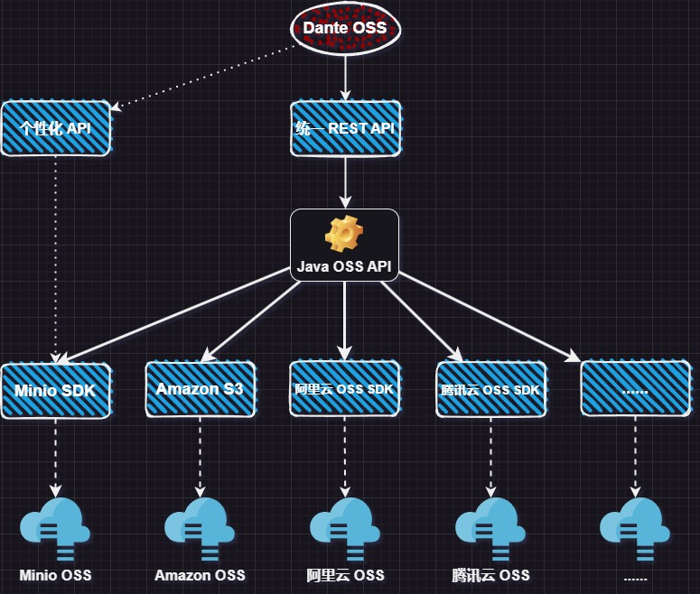

<h1 align="center">Dante OSS</h1>
<h2 align="center">丰富 · 全面 | 简单 · 便捷</h2>
<p align="center">让 Minio 的集成和使用更简单</p>

---

<p align="center">
    <a href="https://spring.io/projects/spring-boot" target="_blank"></a>
    <a href="#" target="_blank"></a>
    <a href="https://bell-sw.com/pages/downloads/#downloads" target="_blank"></a>
    <a href="./LICENSE"></a>
    <a href="https://www.herodotus.cn"></a>
    <a href="https://blog.csdn.net/Pointer_v" target="_blank"></a>
    <a href="https://gitee.com/dromara/dante-cloud"></a>
    <a href="https://gitee.com/dromara/dante-cloud"></a>
    <a href="https://gitee.com/herodotus/dante-oss"></a>
    <a href="https://gitee.com/herodotus/dante-oss"></a>
</p>
<p align="center">
    <a href="https://gitee.com/dromara/dante-cloud">示例微服务应用</a> &nbsp; | &nbsp;
    <a href="https://gitee.com/herodotus/dante-cloud-athena">示例单体应用</a> &nbsp; | &nbsp;
    <a href="https://gitee.com/herodotus/dante-cloud-ui">示例前端应用</a>
</p>

<h1 align="center"> 如果您觉得有帮助，请点右上角 "Star" 支持一下，谢谢！</h1>

## 简介 | Intro

Dante OSS 是一款简化对象存储（OSS）操作的开源框架。借鉴 JPA 标准化设计思想，逐步提取和抽象各厂商 OSS 标准化操作，构建统一的 Java OSS API 规范。形成类似于 JPA 规范的、以 Java OSS API 为核心的、不同 OSS 厂商 SDK 为实现的对象存储使用模式，方便大家在不同厂商 OSS 之间切换而不需要修改代码。

## 目标 | Goal

- 构建类似于 JPA 的 Java OSS API 规范，目标在不改变 API 的情况，通过切换厂商 OSS SDK 实现即可完成对象存储的切换。
- 不局限于常用的上传、下载，而是覆盖所有 OSS SDK 的共性操作。不仅可以方便的实现上传、下载，而且可以快速构建自己的 OSS 管理应用。
- 对共性操作提供统一的 Java API 和 REST API，对 OSS 厂商个性化操作视情况提供单独的 REST API 实现。

## 设计 | Design thinking

Dante OSS 最初的设计目标，是深度封装 Minio Java SDK，可以更方便的实现复杂的 Minio 管理操作，同时提升使用 Minio 自定义开发的便捷度。随着版本的不断迭代，以及更多用户需求的收集，Dante OSS 的设计思想也在不断迭代。

随着 Amazon S3、阿里云等不同 OSS 厂商 SDK 的不断融入，发现虽然各 OSS 产品大多兼容 S3 标准，使用 Amazon S3 SDK 是可以完成其它厂商的 OSS 操作，但也仅限于常规的、基础的 OSS 操作，不能充分发挥个厂商 OSS 的特性。而且由于实现的不同，即使相同的 OSS 操作，传递的参数和返回值也不同，是的相同业务逻辑的代码，如果使用 A 厂商 SDK 实现，在 B 厂商 SDK 上是无法使用的，必须要重新实现一遍才能使用，这极大地的提高了迁移 OSS 的成本。

虽然，现在也有很多优秀的对象存储操作的封装框架，可以支持的 OSS 厂商 非常多，但是其中支持的操作没有那么丰富。Dante OSS 的目标除了满足 OSS 常规操作的使用以外，还行希望提供更丰富的、统一的 OSS 管理操作，用户可以更方便的在自己的应用中集成和开发更丰富、更新细致 OSS 管理功能。

因此，Dante OSS 在维持原有简化 Minio 管理操作目标的基础之上，借鉴 JPA 标准化设计思想，提取和抽象 OSS 标准化操作，形成统一的 Java OSS API 规范。同时封装可操作任意厂商的、统一的 REST API，形成定义统一、动态实现的应用模式（类似于 Hibernate 是 JPA 的一种实现，Hibernate 以 Dialect 方式支持不同的数据库一样），以方便不同 OSS 的切换和迁移。



> 目前以 Minio 作为 Java OSS API 规范的默认实现，当前仅提供 Minio 个性化操作 REST API 实现。

## 优点 | Advantages

- **零额外学习成本**: 开发者只要会 Spring 和 REST 基本开发，即可无缝集成和使用 Dante OSS
- **降低开发者门槛**: 屏蔽 Minio 等 Java OSS SDK 使用复杂度，使用 Spring 环境标准方式对原有 API 进行简化封装。Service API 和 REST API 开箱即用
- **统一的开发接口**: 构建统一的 Java OSS API 规范，形成统一的 Service API 和 REST API 接口，不需要修改代码即可切换不同厂商 OSS
- **包含的功能丰富**: 改造了 Minio Java SDK 的几乎全部功能，且对大文件分片上传、秒传、直传、断点续传等功能，均采用业内最优解决方案进行实现和融合
- **规范优雅的代码**: 所有函数参数，并未破坏原有 OSS SDK 代码构造器结构，而是在原有方式的基础上抽象简化，编程体验和代码可读性大幅提升
- **完善的注释文档**: 对请求参数、方法、REST API、Validation 提供详实的注释、说明和 OpenAPI 标注，用途用法一目了然，无需再翻阅 Minio 文档和源代码，帮助您节省更多时间
- **丰富的稳定保障**: 统一的、人性化的错误体系、内置的 REST API 防刷、幂等保护、详实准确的 Spring Validation 校验。
- **完整的前端示例**：前端采用一个完整的项目而非 Demo 的形式，全面的展示了前后端交互涉及、接口调用、参数使用、TS 类型定义等各方面内容，可直接用于实际项目或简单改造后构建自己的产品

## 对比 | Compare

具体对比，参见在线文档[【功能说明章节】](http://www.herodotus.cn/ecosphere/oss/how-to-use.html)

## 结构 | Structure

```
dante-oss
├── oss-bom -- Dante OSS 顶级 Maven 依赖，统一控制依赖及其版本
├── oss-dialect -- 不同厂商 OSS 实现。
├    ├── dialect-autoconfigure -- OSS Dialect 自动配置模块
├    ├── dialect-core -- OSS Dialect 通用代码模块
├    ├── dialect-sdk-aliyun -- Aliyun OSS Java SDK 封装代码模块
├    ├── dialect-sdk-minio -- Minio OSS Java SDK 封装代码模块
├    └── dialect-sdk-s3 -- Amazon S3 OSS Java SDK 封装代码模块
├── oss-rest -- Dante OSS REST API
├    ├── rest-sdk-minio -- Minio 特有 REST API 模块
├    └── rest-sdk-specification -- 基于 Dante Java OSS API 规范实现的统一 REST API
├── oss-solution -- 基于 Dante Java OSS API 规范的常规 OSS 应用方案实现模块
├── oss-specification -- Dante Java OSS API 规范定义
├── oss-starter -- Dante OSS 相关 Starter
├    ├── oss-aliyun-spring-boot-starter -- 用于独立使用的 Aliyun OSS Java SDK 封装 Starter。
├    ├── oss-minio-spring-boot-starter -- 用于独立使用的 Minio OSS Java SDK 封装 Starter。
├    ├── oss-s3-spring-boot-starter -- 用于独立使用的 Amazon S3 OSS Java SDK 封装 Starter。
└──  └── oss-spring-boot-starter -- Dante OSS 统一 Starter
```

## 专栏 | Cookbook

**Dante Cloud 技术内幕高阶文档专栏（Cookbook）**

> 因目前所使用的阅读产品支持度有限，想要购买全文请点击对应文章链接，在电脑浏览器中打开后进行购买。

| 序号 | 文章标题                                                                                |    付费    | 说明                                                                               | 扫码阅读                                                           |
|:--:|-------------------------------------------------------------------------------------|:--------:|----------------------------------------------------------------------------------|----------------------------------------------------------------|
| 1  | [Dante Cloud 及相关知识学习方法和学习路径的建议](https://www.foxitsoftware.cn/bhds/read/qwcqbq)      |    免费    |                                                                                  |    |
| 2  | [OAuth 2 中的 Scope 与 Role 深度解析](https://www.foxitsoftware.cn/bhds/payRead/3nxj3r/)   | 付费，有试读章节 | 全网独家，深度解析 OAuth2 协议中和 Spring Security 生态各组件中 Scope 和 Role 概念与原理，以及在实战中的应用        |     |
| 3  | [Spring Boot 3 之自动配置与注入顺序控制](https://www.foxitsoftware.cn/bhds/payRead/1vzfy1/)     | 付费，有试读章节 | Spring 生态重要知识点，掌握步入微服务的关键开关                                                      |       |
| 4  | [Spring Cloud 之 Session 共享及一致性处理](https://www.foxitsoftware.cn/bhds/payRead/pmq4wy) | 付费，有试读章节 | 深入浅出剖析微服务架构 Session 共享技术难点                                                       |  |
| 5  | [OAuth 2 中的鉴权和动态接口鉴权](https://www.foxitsoftware.cn/bhds/payRead/uxq6fi)             | 付费，有试读章节 | 带您跟随 Dante Cloud 源代码，由浅入深全面掌握 Spring Security 5 & 6 以及基于 OAuth2 的微服务动态接口鉴权的原理与实现 |              |

## 使用 | How to use

### 一、基本使用

1. maven 中引入

```xml
<dependency>
    <groupId>cn.herodotus.oss</groupId>
    <artifactId>oss-spring-boot-starter</artifactId>
    <version>最新版本</version>
</dependency>
```

2. 配置 yml 参数

```yaml
herodotus:
  oss:
    dialect: minio
    minio:
      endpoint: http://127.0.0.1:9000
      access-key: XXXXXXXXX
      secret-key: XXXXXXXXX
      use-proxy: true
      proxy-source-endpoint: http://localhost:3000/api
```

3. 统一错误处理

```java
// 参考代码
public static Result<String> resolveException(Exception ex， String path) {
    return GlobalExceptionHandler.resolveException(ex， path);
}

// 或者

@ExceptionHandler({HerodotusException.class， PlatformException.class})
public static Result<String> exception(Exception ex， HttpServletRequest request， HttpServletResponse response) {
    ······
}
```

4. 交互性错误信息反馈

```java
// 在系统统一错误处，调用以下代码即可返回包含自定义错误码的、更具交互性错误信息。
if (ex instanceof HerodotusException exception) {
    Result<String> result = exception.getResult();
    result.path(path);
    log.error("[Herodotus] |- Global Exception Handler, Error is : {}", result);
    return result;
}
```

### 二、选择使用

除了 `dialect-core` 和 `oss-specification` 模块以外，其它所有模块均可以单独使用。可以根据自身需要，仅选择某个模块进行使用。

#### 1. dialect-sdk-aliyun

包含对 Aliyun 基础 API 封装的 Service 代码, 作为 OSS 统一抽象的实现方式之一，也包含对 Dante Java OSS API 规范的实现代码。可以单独使用，引入 `oss-aliyun-spring-boot-starter` 可开启自动配置。

> 目前暂不提供 Aliyun REST API 封装，请根据自身的需要直接申请使用阿里云 REST API 或者使用 Dante OSS 统一 REST API 接口。

#### 2. dialect-sdk-s3

包含对 Amazon S3 基础 API 封装的 Service 代码, 作为 OSS 统一抽象的实现方式之一，也包含对 Dante Java OSS API 规范的实现代码。可以单独使用，引入 `oss-s3-spring-boot-starter` 可开启自动配置。

> 目前暂不提供 Amazon S3 REST API 封装，请根据自身的需要直接申请使用Amazon S3 REST API 或者使用 Dante OSS 统一 REST API 接口。

#### 3. dialect-sdk-minio

包含对 Minio 基础 API 封装的 Service 代码, 作为 OSS 统一抽象的实现方式之一，也包含对 Dante Java OSS API 规范的实现代码。

提供 Minio 标准操作 REST API 封装 `rest-sdk-minio`

> 注意：`rest-sdk-minio` 中不包含大文件分片上传通用解决方案业务功能以及符合 Dante Java OSS API 规范的通用功能 REST API

使用 `oss-minio-spring-boot-starter` 可统一开启 Minio Service 和 REST API 自动配置。

#### 4. rest-sdk-minio

提供 Minio 标准操作 REST API 封装。使用 `oss-minio-spring-boot-starter` 可统一开启 Minio Service 和 REST API 自动配置。

#### 5. rest-sdk-specification

`rest-sdk-specification` 是通过对 Minio、Aliyun、Amazon S3 现有 API 共性内容进行抽象，提取 Dante Java OSS API 规范定义后，形成的统一操作 REST API。目标是形成类似于 Spring Data Repository 统一形式的 Java OSS API 和 REST API，以期在不修改代码的情况下，以一套 API 就可以支持不同的 OSS 厂商的无缝切换。

#### 6. oss-solution

是对大文件分片等主流对象存储业务解决方案的高度抽象，以及相关管理操作 Dante Java OSS API 规范封装。使用该模块就可以方便的、快捷的集成或自定义自己大文件分片实现。

#### 7. oss-spring-boot-starter

Dante OSS 的所有内容，可直接引入使用。以 OSS 共性抽象为基础，通过 Spring Boot 配置，实现不同 OSS 操作实现的切换。目前以 Minio 作为默认实现，同时提供 Minio 相关完整的 REST API。Aliyun 和 Amazon S3 目前仅包含对其 Java SDK 封装的 Service API，作为不同 OSS 实现的可选项。如要使用其 REST API 的方式，请直接按照对应厂商官网文档操作申请即可，暂不考虑将这一部分融入 Dante OSS。

## 贡献 | Committer

1. 在Gitee fork项目到自己的repo 
2. 把fork过去的项目也就是你的项目clone到你的本地
3. 修改代码（记得一定要修改 develop 分支） 
4. commit 代码，push 到自己的库（develop分支） 
5. 登录Gitee 在你首页可以看到一个 pull request 按钮，点击它，填写一些说明信息，然后提交即可。 
6. 等待维护者合并

## 反馈 | Feedback

- 欢迎提交[ISSUE](https://gitee.com/herodotus/dante-oss/issues) ，请写清楚问题的具体原因，重现步骤和环境

## 演示 | Example

Dante OSS 作为 Dante Cloud 生态产品，不在单独提供演示环境和示例，请直接使用 Dante 环境查看效果和了解使用，这样也更贴近实际。

提供基于 Spring Authorization Server 的单体版、微服务版案例，从 SDK、Spring Boot Starter 到完整项目任你选择。前端采用一个基于 Vue3、Typescript5、Vite4、Pinia 2 的完整的前端项目作为集成示例，包括详细的 Typescript 类型定义以及 vue-simple-uploader 等主流组件集成和使用方法。

- 微服务演示环境：[https://gitee.com/dromara/dante-cloud](https://gitee.com/dromara/dante-cloud)
- 单体架构演示环境：[https://gitee.com/herodotus/dante-cloud-athena](https://gitee.com/herodotus/dante-cloud-athena)
- 前端工程演示：[https://gitee.com/herodotus/dante-cloud-ui](https://gitee.com/herodotus/dante-cloud-ui)

> 注意：如果您仅是想了解基本的使用方式和使用效果，建议使用单体架构演示环境。具体搭建方式参见[【在线文档】](http://www.herodotus.cn)中，单体版章节。

## 许可 | License 

本项目基于 Apache License Version 2.0 开源协议，可用于商业项目，但必须遵守以下补充条款。

- 不得将本软件应用于危害国家安全、荣誉和利益的行为，不能以任何形式用于非法为目的的行为。
- 在延伸的代码中（修改现有源代码衍生的代码中）需要带有原来代码中的协议、版权声明和其他原作者 规定需要包含的说明（请尊重原作者的著作权，不要删除或修改文件中的Copyright和@author信息） 更不要，全局替换源代码中的 Dante OSS、Herodotus 或 码匠君 等字样，否则你将违反本协议条款承担责任。
- 您若套用本软件的一些代码或功能参考，请保留源文件中的版权和作者，需要在您的软件介绍明显位置 说明出处，举例：本软件基于 Dante Cloud 微服务架构 或 Dante OSS，并附带链接：https://www.herodotus.cn
- 任何基于本软件而产生的一切法律纠纷和责任，均于作者无关。
- 如果你对本软件有改进，希望可以贡献给我们，双向奔赴互相成就才是王道。
- 本项目已申请软件著作权，请尊重开源。